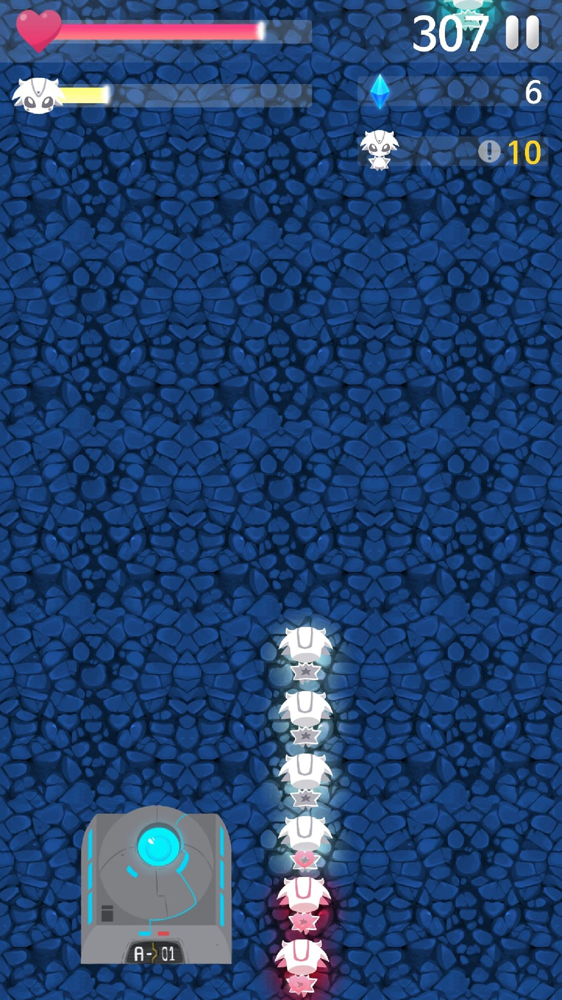

# Extras' Escape
## What is Extras' Escape?
Extras' Escape is mobile casual game.

It is available on Google Play(https://play.google.com/store/apps/details?id=com.foxtail.eescape) and App Store(https://itunes.apple.com/app/id1441017869)

The catchphrase of Extras' Escape is "The game for every extra in the world".

In many story, the story is focused on only heroes. Extras' Escape is stories of many disregarded extra characters.

## Story
Someday, an alien army attacked a peaceful planet H2R-O. Many heroes of H2R-O left the planet to fight with the alien army. But there are still many aliens in the planet. The disregarded extras are trying to survive. This is their story.

## In Game

Player is one extra of the game. Player has to find other extras and rescue them to the shelter.

## Scoreboard
Extras' Escape has scoreboard system. There are two types of the score board. First one is scoreboard of all users. The other one is scoreboard of friends.

## Achievement
Extras' Escape has achievement system. If player achieve some achievements, player will get some rewards.

## Frameworks
Extras' Escape is developed with libGDX written in Java.