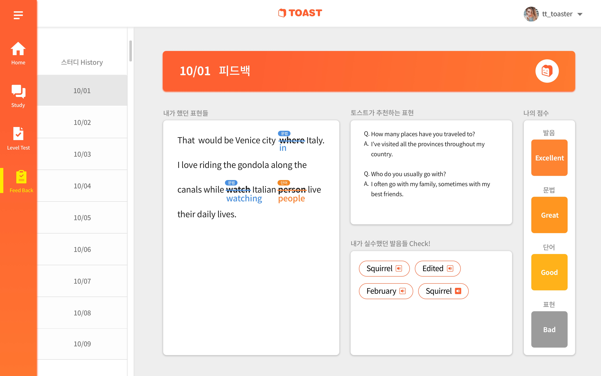

# Toast
* Toast Server(https://github.com/teamtoast/toast-server)
* Toast PC(https://github.com/teamtoast/toast-pc)

## What is Toast?

Toast is an online english speaking study platform providing sentence recommendations and feedbacks by machine learning.

Toast is certified by 9th Software Maestro.

## System
### System Diagram

### webRTC

webRTC is Real-Time Communication technology. webRTC can be used in most web browsers and mobile devices without any plugin. webRTC transfer data as peer-to-peer by using STUN/TURN protocol.

### Toast Study Helper
Toast Study Helper is a chatbot helping the users say more actively. Many english beginner can't say something in conversation because they don't know how to say they want to say. Toast Study Helper is for these people. It provides answer sentence recommendation to users when other users said something to them. When some user say something, the voice data will be converted into text by Google Cloud Speech. The converted text will be sent to Dialogflow agent and other users will get the answer sentence recommendation.

### Feedback

After study finished, each user get feedback of grammer and pronounce. The grammer feedback would be generated by Textgears API. The pronounce feedback would be generated with Google Cloud Speech recoginition accuracy.

## Frameworks
### Server
The server is developed with Spring and written with Java.

### PC(Web)
The pc client is developed with React.