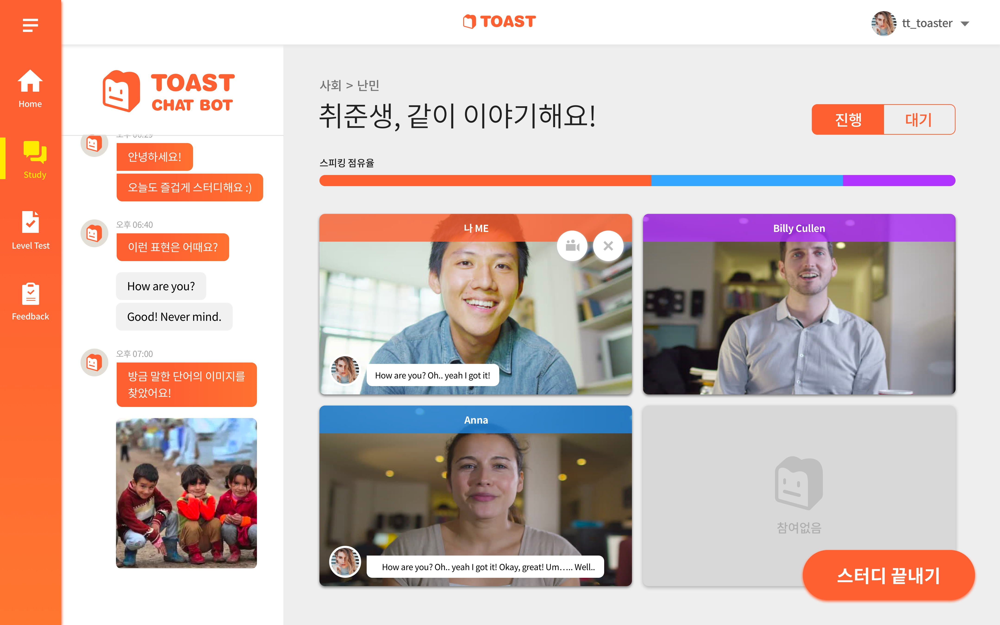
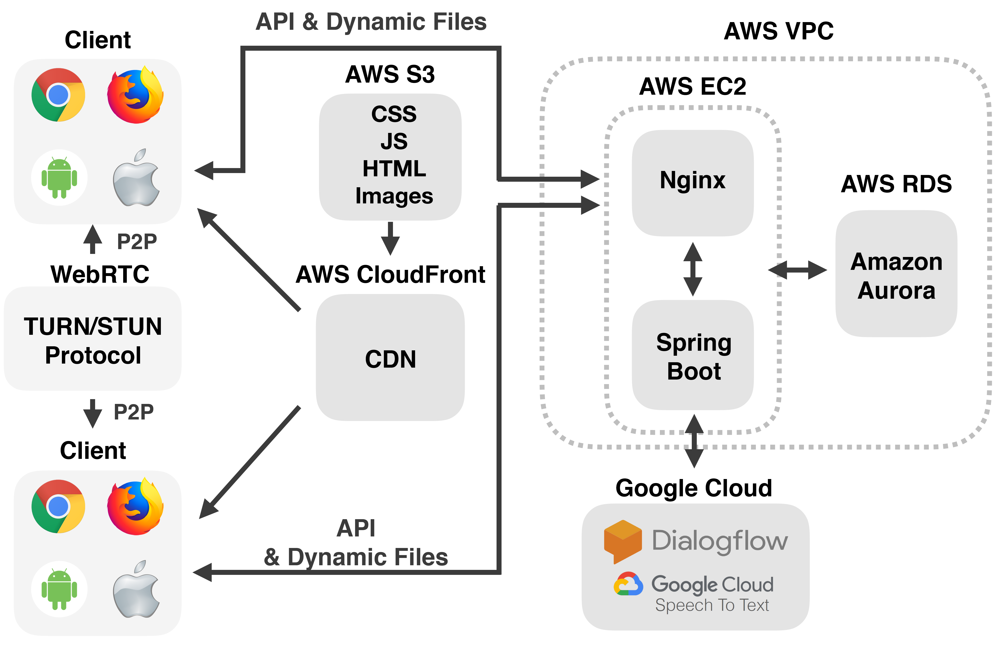

# Toast
## What is Toast?

Toast is an online english speaking study platform providing sentence recommendations and feedbacks by machine learning.

Toast is certified by 9th Software Maestro.

## System
### System Diagram

### Toast Study Helper
Toast Study Helper is a chatbot helping the users say more actively. Many english beginner can't say something in conversation because they don't know how to say they want to say. Toast Study Helper is for these people. It provides answer sentence recommendation to users when other users said something to them. When some user say something, the voice data would be converted into text by Google Cloud Speech. The converted text would 

### Feedback